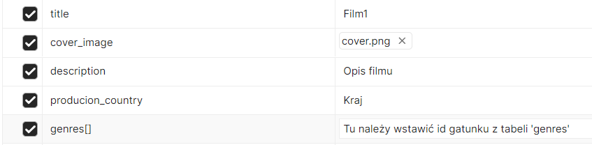

# REST API - zarządzanie filmami 

## Wykorzystane technologie

- Laravel
- PHP
- MySQL

Należy zaimportować bazę danych ```movies.sql```. Baza powinna działać na porcie ```3306``` .

## Endpointy

Aplikacja posiada podstawowe uwierzytelnianie. Użytkownicy mogą mieć jedną z dwóch ról: admin, user.

- **Administrator** ma dostęp do wszystkich zasobów oraz ich dodawania/modyfikowania/usuwania
- **Użytkownik** może wyświetlać filmy oraz dodawać i usuwać opinię do danego filmu

W celu przetestowania endpointów z użyciem **Postmana** należy najpierw uruchomić aplikację serwerową, a następnie wybrać jeden z linków, wkleić go do pola URL, ustawić odpowiednią metodę HTTP i kliknąć ```Send```. 

### Logowanie i wylogowywanie
1. Logowanie: http://localhost:8000/api/login **POST**

    Przykładowe RequestBody:
   ```
   Admin:
   {
    "email": "adam@email.com",
    "password": "password"
   }
   User:
   {
    "email": "john@email.com",
    "password": "password"
   }
   ```
   Zostanie wygenerowany token, który należy umieścić w polu ```Token``` w zakładce ```Authorization```.
   
2. Wylogowywanie: http://localhost:8000/api/logout **POST**

### Gatunki
1. Dodaj gatunek filmu: http://localhost:8000/api/genres **POST**

   Przykładowe RequestBody:
   ```
   {
    "name": "Komedia"
   }
   ```
2. Usuń gatunek o podanym id: http://localhost:8000/api/genres/{id} **DELETE**

### Filmy
1. Dodaj film: http://localhost:8000/api/movies **POST**

   W celu przetestowania dodawania filmu należy przejść w Postmanie do zakładki ```Body```, a następnie wybrać ```form-data``` (ze względu na wgrywanie okładki).
   
    
   
2. Aktualizuj film: http://localhost:8000/api/movies/{id} **PUT**
   
   Instrukcje jak w przypadku dodawania.  
3. Wyświetl dane o wszystkich filmach: http://localhost:8000/api/movies **GET**
4. Wyświetl dane filmu o podanym id: http://localhost:8000/api/movies/{id} **GET**
5. Znajdź film po tytule: http://localhost:8000/api/movies/search?title=nazwa_filmu **GET**
6. Usuń film o podanym id: http://localhost:8000/api/movies/{id} **DELETE**

### Ocena filmów
1. Dodaj ocenę filmu o podanym id: http://localhost:8000/api/movies/{id}/rate **POST**

   Przykładowe RequestBody:
   ```
   {
    "rating_value": 4
   }
   ```
2. Usuń ocenę danego filmu: http://localhost:8000/api/movies/{id}/rate **DELETE**
